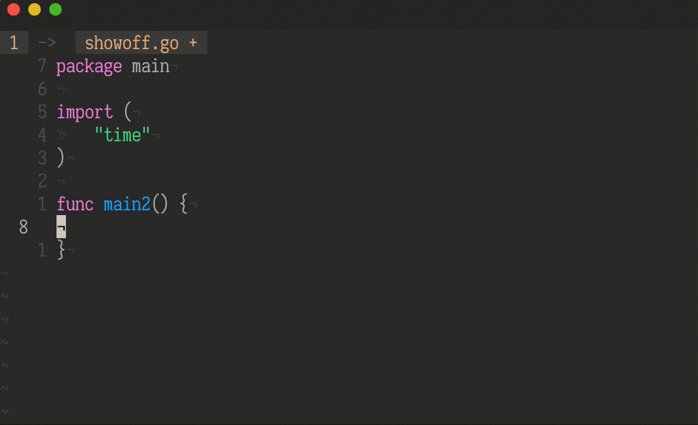

# ncm2-vim-go
An ncm2 source that combines vim-go's gopls integration and ultisnip to give signature help that includes parameter names.

## Demo



## Requirements

1. [fatih/vim-go](https://github.com/fatih/vim-go)
2. [SirVer/ultisnips](https://github.com/SirVer/ultisnips)

**UltiSnips Configuration**

```
    " CTRL-C doesn't trigger the InsertLeave autocmd . map to <ESC> instead.
    inoremap <c-c> <ESC>

    " make UltiSnips register a named key for triggering expansion. this named
    " key is then used to expand the ncm2 completion (<c-u>).
    let g:UltiSnipsExpandTrigger = "<Plug>(ultisnips_expand)"

    function! my_ncm2_expand()
        call ncm2#enable_for_buffer()
        " NOTE: this key binding has to be defined after
        " ncm2#enable_for_buffer() for it to actually trigger the expansion
        imap <silent> <expr> <c-u> ncm2_ultisnips#expand_or("\<Plug>(ultisnips_expand)", 'm')
    endfunction

    augroup ncm2_completion
        autocmd!
        autocmd BufEnter * call my_ncm2_expand()
    augroup END
```
